# STM32H7R/S bootflash MCU + OSPI example

The example will guide you through creating a project based on an STM32H7R/S bootflash MCU with OSPI interface.
The bootflash MCU comes with a small embedded Flash (64KB) used primarily for the initial boot sequence with user application residing in external memory.
OSPI (Octal Serial Peripheral Interface) utilizes eight data lines to connect an external NOR flash memory to the MCU.
We'll be utilizing the NUCLEO-H7S3L8 board as our hardware platform.


## What we will create

1. Bootloader: to configure necessary hardware incl. the OSPI and jump to the application in external memory
2. External Memory Loader: to access and manage the external memory (read/write/erase)
3. Application: a simple application firmware that toggles an LED, which will be located in the external flash memory

## Prerequisites

- STM32CubeMX
- STM32CubeIDE (or a different IDE)
- NUCLEO-H7S3L8 board

## STM32CubeMX 

### Project startup

#### 1. Run STM32CubeMX
#### 2. Menu>File>New Project...

   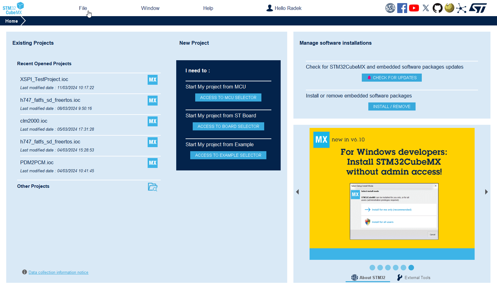

#### 3. Search for STM32H7S3L8H6 (same as on NUCLEO-H7S3L8)


#### 4. Start a new project 

#### 5. Respond to the pop-up by agreeing to apply the default configuration for the Memory Protection Unit (MPU)


### STM32CubeMX configuration for STM32H7R/S

In case of the STM32H7R/S series STM32CubeMX allows each peripheral to be set up for use with the Bootloader, Application, and External Memory Loader.

#### Bootloader 
Its task is to initialize the system's hardware, system clock and particularly the serial memory interface (OSPI) and hand over the code execution to the main application firmware in external memory.
The bootloader code will be placed into the MCU's internal flash.

#### Application 
This is our main application firmware. Our main application's code will reside in external memory and will be linked to the OSPI memory region.

#### External Memory Loader
It initializes the serial memory interface (OSPI) and then enables to manage the external memory, allowing for programming, reading, and erasing of its contents. 
During its use, the code is loaded into MCU's internal SRAM and executed from there, ensuring the internal flash content remains unchanged.
It can be used with multiple programming tools, such as STM32CubeIDE, STM32CubeProgrammer, IAR EWARM, Keil-MDK.

### Pinout

1. The LED is connected to PD13; configure it as an output. 

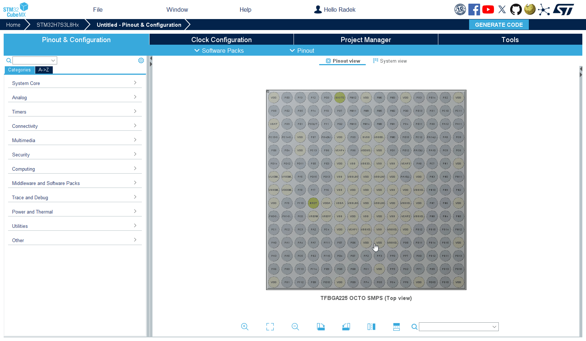

2. Right-click on the pin and select Pin Reservation -> Application
  
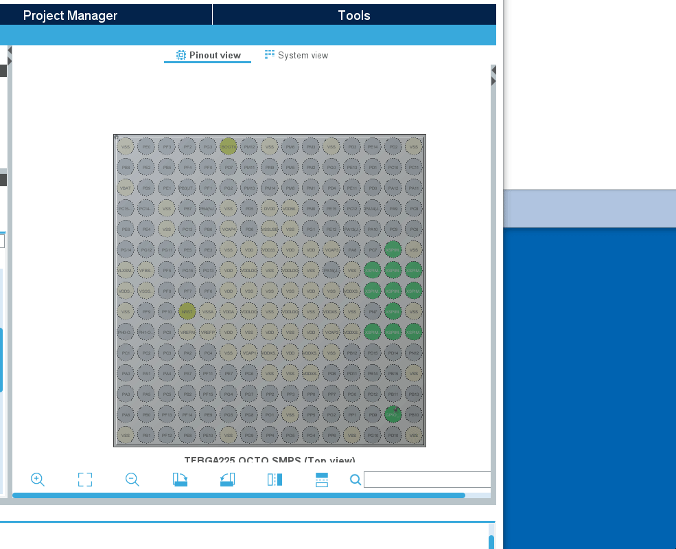

Pin reservation allows you to specify which application has access to use the pin.

### PWR configuration

1. Select RCC
2. Set Supply source to PWR_LDO_SUPPLY (the nucleo board features only an LDO)


### MPU confguration

By default, the MPU disables access to external memory, so we need to enable it.

The same will apply for `CORTEX_M7_BOOT` and `CORTEX_M7_APPLI`
We'll be able to access the OSPI memory region, allowing code to be executed from there and utilizing the core cache.

1. Open `CORTEX_M7_BOOT` and `CORTEX_M7_APPLI`
2. Region 1 `enable`
3. Region base address `0x90000000`
4. Region size `32MB`
5. Access permission to `ALL ACCESS PERMITTED`
6. Instruction access `ENABLE`
7. Cacheable `ENABLE`
8. Bufferable `ENABLE`

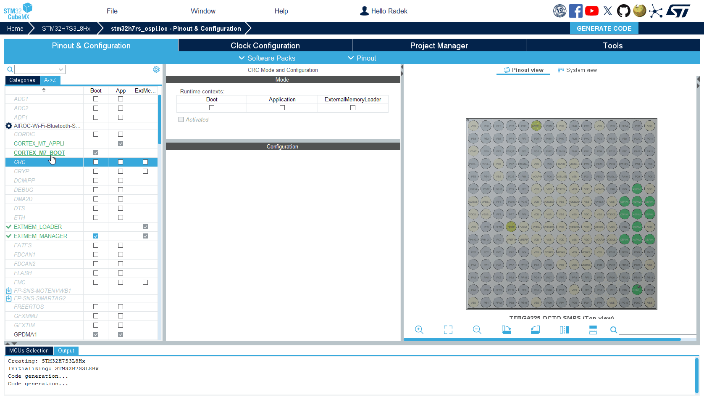

### XSPI Mode

We will use XSPI1 (currently for OSPI doesn't matter)

1. Select XSPI1 configuration for `Bootloader` and for `External loader`
   
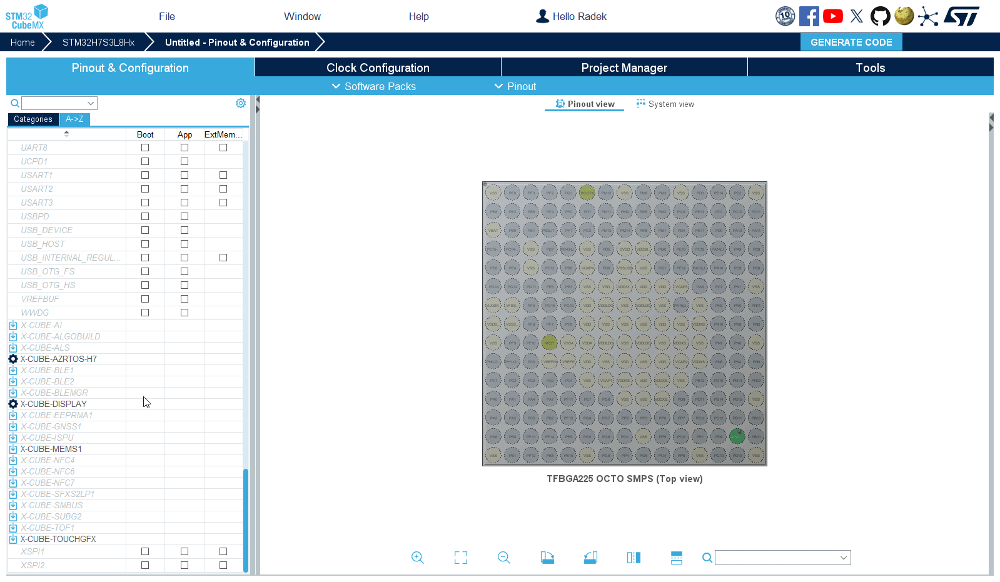

2. Select XSPI1
3. Select Mode to `Octo SPI`
4. Select port to `Port 2 Octo`
5. Select Chip select override to `NCS1 - Port 2`

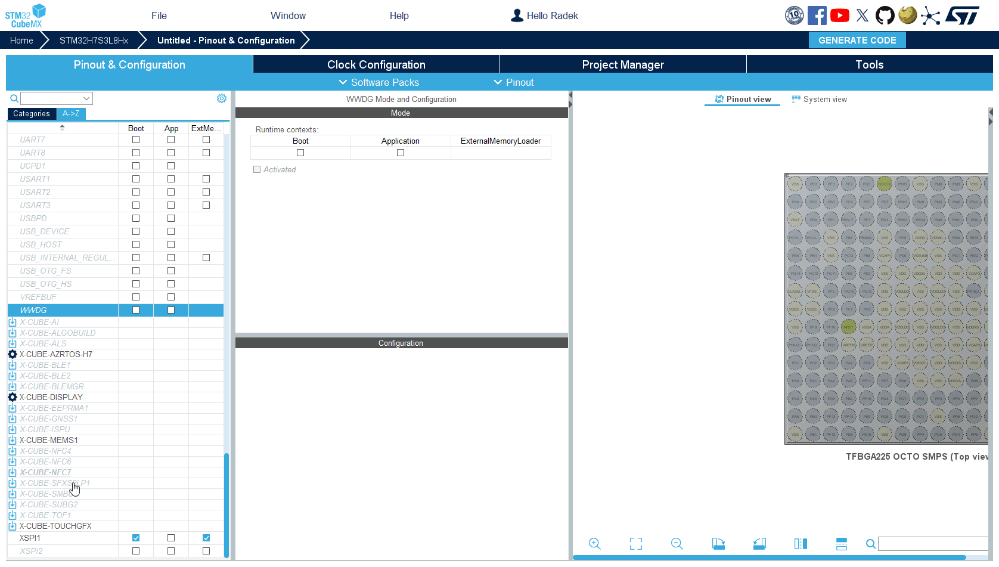

### XSPI configration

1. Select Memory type to `Macronix` (memory on nucleo) 
2. Memory size to `32 MBytes`
3. Chip Select High Time Cycle to `2`
4. Set De;ay Hold Quarter Cycle to `Enable`


### SBS configruation

The OSPI is powered from XSP2 domain. Which is 1.8V. For this reason HSLV(high speed low voltage) feature must be used. 

The SBS must be still enabled in option bytes. 
!!! Be sure that you enable it only when the domain is really low voltage. If the memory is running from 3.3V HSLV can damage the STM32.


1. Select SBS for `Bootloader` and `External Loader`
2. Select SBS periphery
3. Activate SBS
4. Set IO HSLV for XSPIM2 to `ENABLE`


The `IO HSLV for XSPIM2` is selected because we use Port 2 for XSPI1. 


### EXTMEM_MANAGER - External Memory manager

Is library which can automaticaly configura the external memory (xSPI) if the memory support  `SFDP` (Serial Flash Discoverable Parameter defined by JEDEC). Or the memory conected to SDMMC. 

1. Select EXTMEM_MANAGER for `Bootloader` and External Loader(enabled by default)
2. Check `Activate External Memeory Manager`

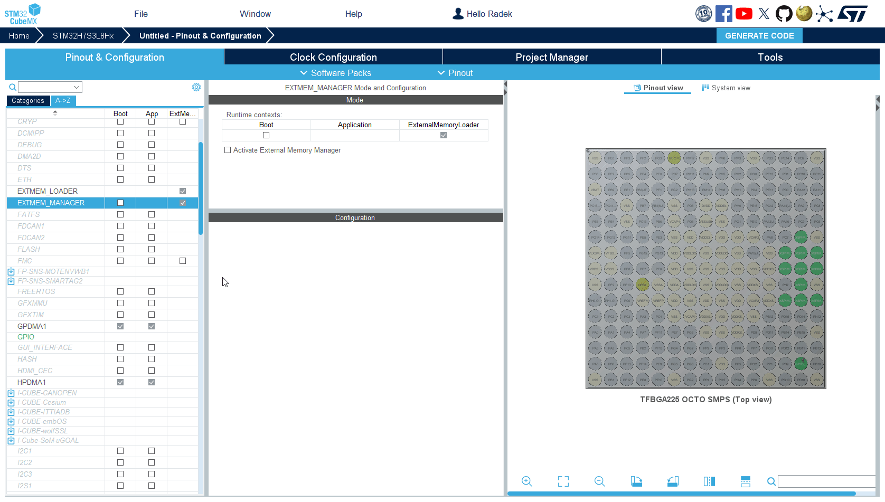

3. Go to Boot usecase tab
4. Set `select boot code generation`

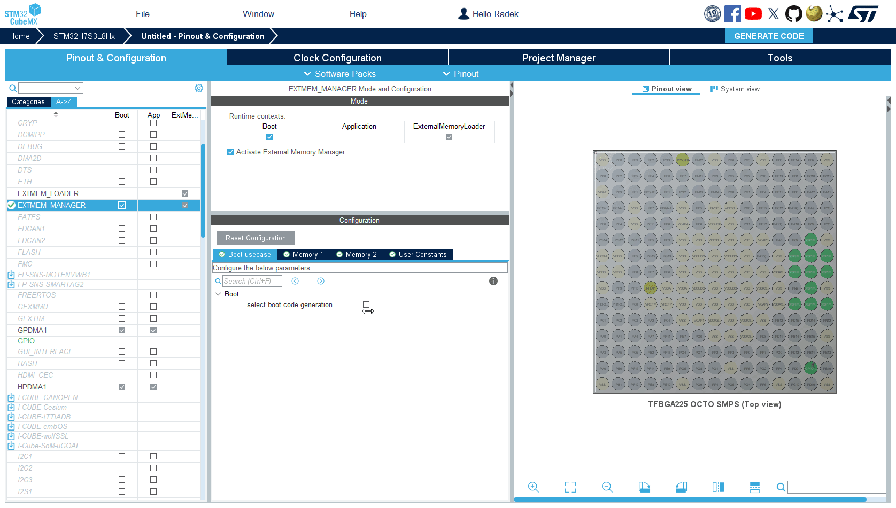


We keep `execution in place` (mean code is executed directly from external memory)
Second option Load and Run mean the code will be loaded from memory and stored in RAM(internal or external) where will be executed. 

Memory is `Memory 1 `

5. Go to Memory 1 tab
6. Select Number of memory data line to `EXTMEM_LINK_CONFIG_8LINES`

Rest keep in default Memory driver to `EXTMEM_NOR_SFDP`
And memory instance to `XSPI1`

### EXTMEM_LOADER

1. select EXTMEM_LOADER
2. Check Activate External Memory Loader

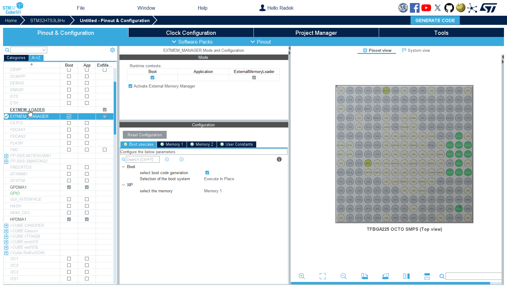

3. select `External Memory Loader` tab
4. Set number of sector to `8192`
5. Set Sector size to `4096`

All this taken from memory DS 

You can change the `loader name` to recognize it if needed
Also `programmming/erase time` can be more tuned based on memory DS

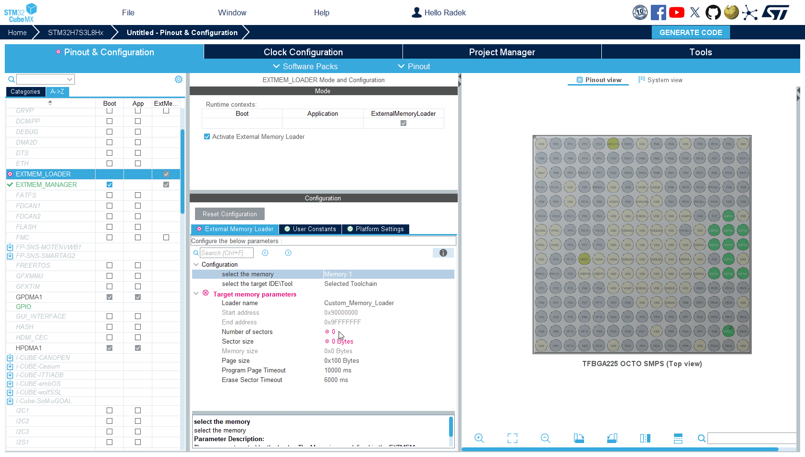


### Clock Configuration

1. Go to `Clock Configuration` tab
2. We can set HCLK to 600MHz
   1. Set DIVM to `/16`
   2. DIVN1 to `300`
   3. Set System Clock Mux to `PLLCLK`
   4. Set BMPRE to `/2`
   5. Set PPRE5, PPRE1 PPRE2 and PPRE4 to `/2`

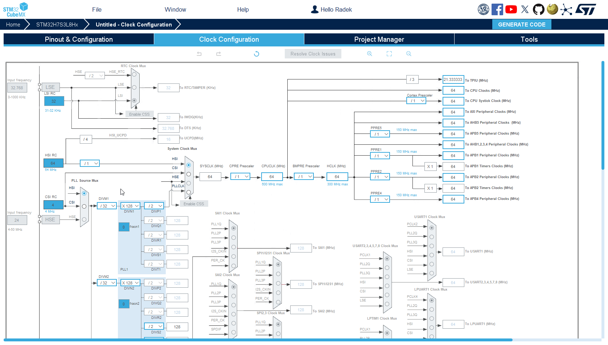


3. Set XSPI clock to 200MHz
   1. Set XSPI1 Clock mux to `PLL2S`
   2. Set DIVM2 to `/4`
   3. set DIVN2 to `50`
   4. Set DIVS2 to `/4`

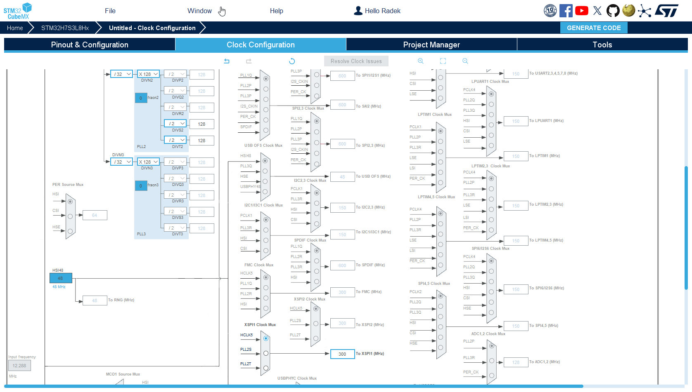

On H7RS the XSPI can run to 200MHz

### Project Manager

1. Go to `Project Manager` tab
2. Name your project and select location 
3. select `ExtMemLoade Project`
4. Select CubeIDE as Toolchain
5. Generate Project


### CubeProgrammer

1. Click to `Connect`
2. select `Option bytes`
3. Select `User configuration 1`
4. Enable `XSPI2_HSLV`


### CubeIDE

1. Open CubeIDE
2. Import Project to CubeIDE or let MX to import project for you.
3. You should have one main project and three sub project in IDE. 

4. Open Application project and the main.c
5. Att there code for GPIO toggling

```c
	  HAL_GPIO_TogglePin(GPIOD, GPIO_PIN_13);
	  HAL_Delay(500);
```

into infinite loop:
```c
  /* Infinite loop */
  /* USER CODE BEGIN WHILE */
  while (1)
  {
    /* USER CODE END WHILE */

    /* USER CODE BEGIN 3 */
	  HAL_GPIO_TogglePin(GPIOD, GPIO_PIN_13);
	  HAL_Delay(500);
  }
  /* USER CODE END 3 */
}
```

6. Open Bootloader project
7. Go to main.c
8. Go to main function 
9. Add Cache invalidation functions

```c
  /* USER CODE BEGIN 1 */

  SCB_InvalidateDCache();
  SCB_InvalidateICache();
  /* USER CODE END 1 */
```

This is because after reset the cache can contain invalid data. And the JumToApplication function will clen the cache and this invalid records will cause hardfault.  

10. Compile all projects.
11. Select Application project and run debug


12. check that external loader is present in debugger tab

13. Go to setup tab
14. Add Bootloader code that it will be loaded to and we will see the code
15. Clikc OK


If you are using application for debug. You will start in Hardfault. It is because the debugger start the Application directly. He not reset the device. You must click on reset to physically reset the device and allow him to jump to bootloader. And then run to applciation. 
